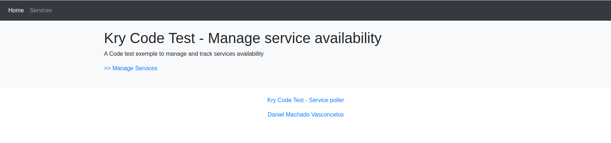
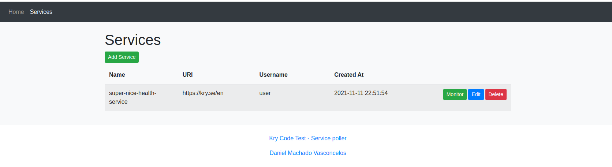
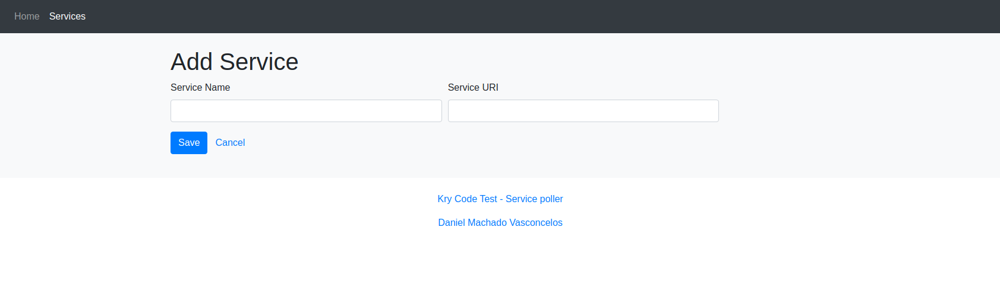

# Kry - Health Check Service (Front End)

## Daniel Machado Vasconcelos

### Extra requirements:

* The results from the poller are automatically shown to the user (no need to reload the page to see results)
* We want to have informative and nice looking animations on add/remove services

Prerequisites
-------------

* NodeJs ^16.0


### Architectural Decisions

**Framework**:
I used the [easy-peasy](https://easy-peasy.vercel.app/docs/introduction/) lib to encapsulate the redux API and reduce a little the boilerplate of a redux store.
Under the hood the lib uses redux. 

**CSS**:
I used the CDN [bootstrap](https://getbootstrap.com/docs/4.0/getting-started/introduction/) just to give a little of colors to the application, and have a nice view with big buttons and tables.

**JSX**
I tried to avoid artificially separating the markup and logic in separate file. Just to keep it simple. 


## How to build?

Clone this repo into new project folder (e.g., `kry-service-front-end`).

```bash
git clone https://github.com/DanielMachadoVasconcelos/kry-code-test-front-end.git
cd kry-code-test-front-end
```

Run the npm command to build and start your application

(Always a good practice to runa a **$ npm install**)

```bash
npm run build
```

```bash
npm run start
```

The application will automatically open on:
```bash
http:/localhost:3000
```

---
> **_NOTE:_**  To see some data make sure to have the [Back End](https://github.com/DanielMachadoVasconcelos/kry-code-test) up and running in your computer.
---

(I know! I should have added everything into a docker compose and make everybody happy. :disappointed: )

### Pages

Home:


Services:

---
> **_NOTE:_**  The monitor button was suppose to show the results over time in a line chart.
---

Add:

